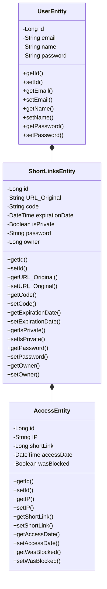
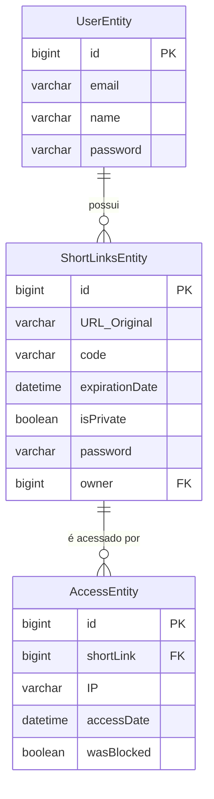

# Descrição do projeto

Este projeto visa o desenvolvimento de um encurtador de links, o qual, além de realizar o encurtamento, fornecerá login de usuário e funções exclusivas para o usuário autenticado.

---

# Requisitos funcionais 
| **RF01** | **Cadastrar usuário** |
| -- | -- |
| **Descrição** | O usuário poderá preencher um formulário com nome, e-mail e senha. Ao enviar o formulário, será criado um novo cadastro no sistema. |
| **Prioridade** | Essencial |
| **Caso de uso relacionado** | UC01 |

| **RF02** | **Logar usuário** |
| -- | -- |
| **Descrição** | O usuário poderá acessar o sistema inserindo e-mail e senha. Após autenticação válida, será redirecionado à tela inicial. |
| **Prioridade** | Essencial |
| **Caso de uso relacionado** | UC02 |

| **RF03** | **Apagar conta** |
| -- | -- |
| **Descrição** | O usuário poderá excluir permanentemente sua conta e todos os dados relacionados. |
| **Prioridade** | Essencial |
| **Caso de uso relacionado** | UC03 |

| **RF04** | **Encurtar link** |
| -- | -- |
| **Descrição** | Gera um link encurtado a partir do link original. O identificador pode ser definido pelo usuário (se disponível) ou gerado de forma aleatória pelo sistema. |
| **Prioridade** | Essencial |
| **Caso de uso relacionado** | UC04 |

| **RF05** | **Listar links** |
| -- | -- |
| **Descrição** | Lista os links encurtados pelo usuário autenticado. |
| **Prioridade** | Alta |
| **Caso de uso relacionado** | UC05 |

| **RF06** | **Apagar link** |
| -- | -- |
| **Descrição** | Apaga o link encurtado da base de dados do sistema. |
| **Prioridade** | Alta |
| **Caso de uso relacionado** | UC06 |

| **RF07** | **Ver métricas do link** |
| -- | -- |
| **Descrição** | Exibe estatísticas do link, como número de acessos e data de cada acesso. (Opcional: IPs que acessaram). |
| **Prioridade** | Baixa |
| **Caso de uso relacionado** | UC07 |

| **RF08** | **Adicionar senha ao link** |
| -- | -- |
| **Descrição** | Torna o link privado, exigindo a senha informada pelo usuário para permitir acesso ao destino original. |
| **Prioridade** | Normal |
| **Caso de uso relacionado** | UC08 |

| **RF09** | **Remover senha do link** |
| -- | -- |
| **Descrição** | Remove a exigência de senha para acessar o link original, apagando a senha vinculada. |
| **Prioridade** | Normal |
| **Caso de uso relacionado** | UC09 |

| **RF10** | **Acessar link** |
| -- | -- |
| **Descrição** | Redireciona o usuário para a página original a partir do link encurtado. |
| **Prioridade** | Essencial |
| **Caso de uso relacionado** | UC10 |

| **RF11** | **Validar acesso ao link** |
| -- | -- |
| **Descrição** | Caso o link seja protegido por senha, o sistema solicitará a senha antes do redirecionamento. Se a senha estiver incorreta, o acesso será negado. (Opcional: após 20 tentativas incorretas, o sistema poderá bloquear acessos do mesmo IP). |
| **Prioridade** | Normal |
| **Caso de uso relacionado** | UC11 |

| **RF12** | **Expiração de link** |
 | -- | -- |
| **Descrição** | O usuário poderá definir uma data ou quantidade máxima de acessos, após a qual o link deixará de funcionar. |
| **Prioridade** | Baixo |
| **Caso de uso relacionado** | UC12 |

| **RF13** | **BloquearIP** |
 | -- | -- |
| **Descrição** | O usuário poderá restringir acessos de determinados IPs ou domínios. |
| **Prioridade** | Opcional |
| **Caso de uso relacionado** | UC13 |

| **RF14** | **Busca de links** |
 | -- | -- |
| **Descrição** | Permitir localizar rapidamente um link encurtado pelo identificador ou destino original. |
| **Prioridade** | Opcional |
| **Caso de uso relacionado** | UC14 |

# Casos de uso

|**UC01** | **Cadastrar usuário** |
| -- | -- |
| **Descrição** | Cria um perfil para acesso ao sistema. |
| **Atores** | Usuário não autenticado |
| **Pré-condições** | O usuário ainda não possui conta. |
| **Fluxo Principal** | 1. O usuário acessa a tela de cadastro. 2. Preenche os dados obrigatórios (nome, e-mail, senha). 3. Confirma o cadastro. 4. O sistema valida os dados e cria o perfil. 5. O sistema confirma a criação da conta. |
| **Fluxo Alternativo** | - Se algum campo obrigatório não for preenchido, o sistema solicita correção. - Se o e-mail já estiver cadastrado, o sistema exibe mensagem de erro. |
| **Pós-condições** | O usuário terá um perfil criado e poderá acessar o sistema. |

|**UC02** | **Logar usuário** |
| -- | -- |
| **Descrição** | Permite autenticar-se no sistema. |
| **Atores** | Usuário não autenticado |
| **Pré-condições** | O usuário deve ter cadastro no sistema. |
| **Fluxo Principal** | 1. O usuário acessa a tela de login. 2. Informa e-mail e senha. 3. O sistema valida as credenciais. 4. O sistema autentica o usuário e redireciona para a página inicial. |
| **Fluxo Alternativo** | - Se os dados forem inválidos, o sistema exibe mensagem de erro. - Após várias tentativas inválidas, o sistema pode bloquear temporariamente o acesso. |
| **Pós-condições** | O usuário estará autenticado e terá acesso ao sistema. |

|**UC03** | **Apagar conta** |
| -- | -- |
| **Descrição** | Permite excluir permanentemente a conta e dados associados. |
| **Atores** | Usuário autenticado |
| **Pré-condições** | O usuário deve estar autenticado no sistema. |
| **Fluxo Principal** | 1. O usuário acessa as configurações de conta. 2. Seleciona a opção "Apagar conta". 3. Confirma a exclusão. 4. O sistema remove todos os dados associados. 5. O sistema confirma a exclusão. |
| **Fluxo Alternativo** | - Se o usuário cancelar a operação, a conta permanece ativa. - Se houver falha na exclusão de dados, o sistema exibe mensagem de erro. |
| **Pós-condições** | A conta e todos os dados associados serão permanentemente removidos. |

|**UC04** | **Encurtar link** |
| -- | -- |
| **Descrição** | Cria um link encurtado a partir de um original. |
| **Atores** | Usuário autenticado |
| **Pré-condições** | O usuário deve estar autenticado e possuir link original válido. |
| **Fluxo Principal** | 1. O usuário acessa a opção "Encurtar link". 2. Informa o URL original. 3. O sistema gera link encurtado único ou caso o usuário queira e esteja disponivel ele pode usar um identificador personalizado. 4. O sistema confirma a criação do link. |
| **Fluxo Alternativo** | - Se o URL for inválido, o sistema solicita correção. - Se o link já tiver sido encurtado, o sistema pode sugerir o link existente. |
| **Pós-condições** | O link original terá uma versão encurtada disponível para uso. |

|**UC05** | **Listar links** |
| -- | -- |
| **Descrição** | Exibe todos os links encurtados do usuário logado. |
| **Atores** | Usuário autenticado |
| **Pré-condições** | O usuário deve estar autenticado e possuir links cadastrados. |
| **Fluxo Principal** | 1. O usuário acessa a lista de links. 2. O sistema exibe todos os links encurtados do usuário, com detalhes básicos. |
| **Fluxo Alternativo** | - Se não houver links cadastrados, o sistema exibe "Nenhum link disponível". |
| **Pós-condições** | O usuário visualiza os links encurtados cadastrados. |

|**UC06** | **Apagar link** |
| -- | -- |
| **Descrição** | Permite excluir permanentemente um link encurtado. |
| **Atores** | Usuário autenticado |
| **Pré-condições** | O link deve estar cadastrado pelo usuário. |
| **Fluxo Principal** | 1. O usuário acessa a lista de links. 2. Seleciona o link a ser apagado. 3. Confirma exclusão. 4. O sistema remove o link. 5. O sistema confirma a exclusão. |
| **Fluxo Alternativo** | - Se o usuário cancelar, o link permanece ativo. - Se houver falha na exclusão, o sistema exibe mensagem de erro. |
| **Pós-condições** | O link será removido permanentemente do sistema. |

|**UC07** | **Ver métricas do link** |
| -- | -- |
| **Descrição** | Permite visualizar estatísticas de acesso do link. |
| **Atores** | Usuário autenticado |
| **Pré-condições** | O link deve estar cadastrado pelo usuário. |
| **Fluxo Principal** | 1. O usuário acessa a lista de links. 2. Seleciona o link desejado. 3. O sistema exibe métricas como número de acessos, localização e dispositivos. 4. O usuário visualiza os dados apresentados. |
| **Fluxo Alternativo** | - Se o link não tiver acessos, o sistema exibe “Nenhum acesso registrado”. - Se houver erro na coleta de métricas, o sistema exibe mensagem de falha. |
| **Pós-condições** | O usuário terá acesso às estatísticas de desempenho do link. |

|**UC08** | **Adicionar senha ao link** |
| -- | -- |
| **Descrição** | Torna o link privado exigindo senha para acesso. |
| **Atores** | Usuário autenticado |
| **Pré-condições** | O link deve estar cadastrado pelo usuário. |
| **Fluxo Principal** | 1. O usuário acessa as configurações do link. 2. Seleciona a opção “Adicionar senha”. 3. Define uma senha para o link. 4. O sistema registra a senha. 5. O sistema confirma que o link está protegido. |
| **Fluxo Alternativo** | - Se a senha não atender aos critérios (tamanho mínimo, caracteres especiais), o sistema solicita nova senha. - Se o usuário cancelar a operação, o link permanece sem senha. |
| **Pós-condições** | O link terá acesso protegido por senha. |

|**UC09** | **Remover senha do link** |
| -- | -- |
| **Descrição** | Retira a proteção de senha do link. |
| **Atores** | Usuário autenticado |
| **Pré-condições** | O link deve estar protegido por senha. |
| **Fluxo Principal** | 1. O usuário acessa as configurações do link. 2. Seleciona a opção “Remover senha”. 3. Confirma a remoção. 4. O sistema remove a senha do link. 5. O sistema confirma que o link está acessível sem senha. |
| **Fluxo Alternativo** | - Se o usuário cancelar a operação, a senha permanece ativa. - Se houver falha na remoção, o sistema exibe mensagem de erro. |
| **Pós-condições** | O link estará acessível sem necessidade de senha. |

|**UC10** | **Acessar link** |
| -- | -- |
| **Descrição** | Redireciona para o link original a partir do encurtado. |
| **Atores** | Qualquer usuário |
| **Pré-condições** | O link encurtado deve existir e estar ativo. |
| **Fluxo Principal** | 1. O usuário acessa o link encurtado. 2. O sistema verifica se o link existe e está ativo. 3. O sistema redireciona para o URL original. |
| **Fluxo Alternativo** | - Se o link não existir ou estiver expirado, o sistema exibe mensagem de erro. - Se o link estiver protegido por senha, o sistema solicita validação (UC12). |
| **Pós-condições** | O usuário acessará o URL original associado ao link encurtado. |

|**UC11** | **Validar acesso ao link** |
| -- | -- |
| **Descrição** | Caso o link seja privado, valida a senha antes do redirecionamento. |
| **Atores** | Qualquer usuário |
| **Pré-condições** | O link deve estar protegido por senha. |
| **Fluxo Principal** | 1. O usuário acessa o link encurtado. 2. O sistema solicita a senha. 3. O usuário informa a senha. 4. O sistema valida a senha. 5. Se correta, redireciona para o URL original. |
| **Fluxo Alternativo** | - Se a senha estiver incorreta, o sistema solicita nova tentativa. - Após múltiplas tentativas inválidas, o sistema pode bloquear temporariamente o acesso. |
| **Pós-condições** | O usuário terá acesso ao link somente se fornecer a senha correta. |

|**UC12** | **Expiração de link** |
| -- | -- |
| **Descrição** | Permite que o usuário defina uma data de validade ou número máximo de acessos, após os quais o link encurtado deixa de funcionar. |
| **Atores** | Usuário (principal), Sistema (secundário) |
| **Pré-condições** | O usuário deve estar autenticado e o link já deve ter sido criado. |
| **Fluxo Principal** | 1. O usuário acessa a lista de links. 2. Seleciona um link e solicita configurar expiração. 3. Informa data de expiração **ou** quantidade máxima de acessos. 4. O sistema registra a configuração. 5. O sistema confirma a definição de expiração. |
| **Fluxo Alternativo** | - Se o usuário não informar configuração válida, o sistema solicita nova entrada. - Caso a data seja anterior à atual, o sistema exibe mensagem de erro. |
| **Pós-condições** | O link terá uma regra de expiração e ficará inativo após o prazo ou limite definido. |

|**UC13** | **Bloquear IP** |
| -- | -- |
| **Descrição** | O usuário pode restringir acessos de determinados IPs ou domínios a um link encurtado. |
| **Atores** | Usuário (principal), Sistema (secundário) |
| **Pré-condições** | O usuário deve estar autenticado e o link já deve estar cadastrado. |
| **Fluxo Principal** | 1. O usuário acessa as configurações de um link. 2. Seleciona a opção "Bloquear IP/Domínio". 3. Informa um ou mais IPs/domínios. 4. O sistema salva as restrições. 5. O sistema confirma o bloqueio. |
| **Fluxo Alternativo** | - Se o formato do IP/domínio for inválido, o sistema exibe erro. - Caso o usuário bloqueie todos os acessos, o sistema alerta que o link ficará inacessível. |
| **Pós-condições** | O link terá restrições aplicadas, negando acesso aos IPs/domínios bloqueados. |

|**UC14** | **Busca de links** |
| -- | -- |
| **Descrição** | Permite localizar links encurtados rapidamente pelo identificador ou URL original. |
| **Atores** | Usuário (principal), Sistema (secundário) |
| **Pré-condições** | O usuário deve estar autenticado e o sistema deve ter links cadastrados. |
| **Fluxo Principal** | 1. O usuário acessa a interface de busca. 2. Digita o termo de pesquisa (identificador ou URL). 3. O sistema processa a consulta. 4. O sistema exibe os resultados correspondentes. |
| **Fluxo Alternativo** | - Se não houver resultados, o sistema exibe "Nenhum link encontrado". - Se o termo for inválido, o sistema solicita correção. |
| **Pós-condições** | O usuário acessa a lista filtrada de links encurtados que correspondem à busca. |

* **Diagrama de classes**

* **Diagrama relacional*
